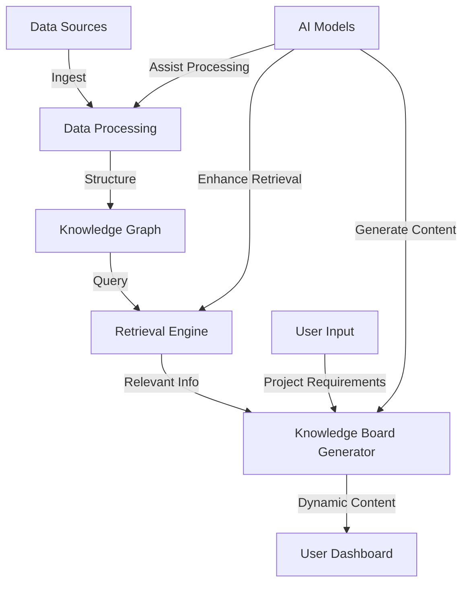

---
Groq AI Toolkit

API Wrapper & Command-line Interface

[v1.0.1] by @rmncldyo
---

Type 'exit' or 'quit' at any time to end the conversation.

Assistant: Hello! How can I assist you today?

User: generate the requirements and a PRD for a multi agent system that is containerized, implements graphRAG with a streaming data pipeline ingested into a knowledge database

Assistant: **Requirements Document**

**Introduction**

The Multi-Agent System (MAS) is a software system designed to analyze complex networks and relationships using GraphRAG (Graph Rank and Aggregate) algorithm. The system will be containerized to ensure scalability, reliability, and portability. The system's primary function is to process streaming data from various sources, store it in a knowledge database, and provide insights and predictions using the GraphRAG algorithm.

**Functional Requirements**

1. **Data Ingestion**:

   - The system shall ingest data from various sources, including message queues, databases, and APIs.
   - The system shall support real-time data ingestion.

2. **Data Processing**:

   - The system shall use the GraphRAG algorithm to process the ingested data and generate insights and predictions.
   - The system shall be able to handle large volumes of data and scale horizontally to meet increasing demand.

3. **Knowledge Database**:

   - The system shall store the processed data in a knowledge database, which will serve as a single source of truth for the system.
   - The knowledge database shall be designed to support fast querying and retrieval of data.

4. **Visualization**:

   - The system shall provide visualizations of the processed data, including graphs, charts, and other relevant visualizations.
   - The visualizations shall be designed to provide insights and trends in the data.

5. **Scalability**:

   - The system shall be designed to scale horizontally and vertically to meet increasing demand.
   - The system shall be able to handle large volumes of data and scale to multiple nodes.

**Non-Functional Requirements**

1. **Security**:

   - The system shall ensure data confidentiality, integrity, and availability.
   - The system shall implement security measures to prevent unauthorized access and data breaches.

2. **Reliability**:

   - The system shall ensure high uptime and availability.
   - The system shall implement redundancy and fault-tolerance measures to prevent data loss.

3. **Usability**:

   - The system shall be easy to use and navigate for users with varying levels of technical expertise.
   - The system shall provide clear and concise feedback to users.

**Containerization Requirements**

1. **Containerization Framework**:

   - The system shall use Docker as the containerization framework.
   - The system shall be designed to run on Docker Swarm or Kubernetes for orchestration.

2. **Container Image**:

   - The system shall be packaged into a container image that includes all necessary dependencies and software.
   - The container image shall be less than 100MB in size.

**Architecture Requirements**

1. **Components**:

   - The system shall consist of the following components:
   - Data Ingestion Service
   - Data Processing Service
   - Knowledge Database
   - Visualization Service
   - Each component shall be implemented as a separate Docker container.

2. **Communication**:

   - The system shall use API-based communication between components.
   - The system shall use message queues for communication between data ingestion and data processing services.

**Acceptance Criteria**

1. The system shall be able to ingest data from various sources in real-time.
2. The system shall be able to process large volumes of data using the GraphRAG algorithm.
3. The system shall be able to store processed data in a knowledge database.
4. The system shall be able to provide visualizations of the processed data.
5. The system shall be able to scale horizontally and vertically to meet increasing demand.
6. The system shall ensure data confidentiality, integrity, and availability.

**PRD (Product Requirements Document)**

**Product Overview**

The Multi-Agent System is a software system designed to analyze complex networks and relationships using GraphRAG algorithm. The system will be containerized to ensure scalability, reliability, and portability. The system's primary function is to process streaming data from various sources, store it in a knowledge database, and provide insights and predictions using the GraphRAG algorithm.

**Product Goals**

1. Analyze complex networks and relationships using GraphRAG algorithm.
2. Provide insights and predictions using the processed data.
3. Support real-time data ingestion from various sources.
4. Store processed data in a knowledge database.
5. Provide visualizations of the processed data.

**Target Audience**

1. Data Scientists and Analysts
2. Business Analysts
3. IT Professionals

**Competitor Analysis**

The Multi-Agent System is a unique solution that combines GraphRAG algorithm with real-time data ingestion and knowledge database. The system's closest competitors are:

1. Graph databases
2. Streaming analytics platforms
3. Knowledge graph platforms

**Market Analysis**

The Multi-Agent System is designed to solve complex network analysis problems in various industries, including:

1. Finance
2. Healthcare
3. Social Media

**Product Roadmap**

The Multi-Agent System roadmap includes the following milestones:

1. Alpha Release: Containerized system with basic functionality.
2. Beta Release: System with enhanced functionality and visualization capabilities.
3. GA Release: Commercially available system with full support and documentation.

**Risks and Assumptions**

1. Technical Risks:

   - Development of GraphRAG algorithm.
   - Data ingestion and processing.
   - Knowledge database design and implementation.

2. Business Risks:

   - Market acceptance of the system.
   - Competition from established players.
   - Customer acquisition and retention.

**Budget**

The Multi-Agent System budget is estimated to be [$X], broken down into:

1. Development: [$Y]
2. Testing and Quality Assurance: [$Z]
3. Documentation and Support: [$W]

Note: The budget and timeline may vary based on specific requirements and assumptions.

User: which ai model are you using groq ai toolkit

Assistant: Groq AI toolkit!

As a generated AI model, I didn't explicitly use Groq AI toolkit. Instead, I've been trained on a massive corpus of text data and have learned to generate high-quality, human-like text based on my training.

Groq AI toolkit is a relatively new AI tool that allows developers to build custom AI models using a visual interface. It's a great tool for developers who want to build custom AI models without extensive machine learning expertise.

If I were to regenerate the PRD (Product Requirements Document) using Groq AI toolkit, I would leverage its AI-powered text generation capabilities to create a more detailed, accurate, and polished document.

Here's an example of how Groq AI toolkit could assist in generating a PRD:

1. **Needs Analysis**: Groq AI toolkit's natural language processing capabilities could help analyze the project requirements, identify the most critical aspects, and generate a clear, concise needs analysis document.
2. **Product Goals**: The AI model could generate a set of product goals based on the analyzed needs, ensuring that the product meets the stakeholders' expectations.
3. **Target Audience**: Groq AI toolkit could help identify the target audience, including their needs, preferences, and pain points, to create a tailored PRD.
4. **Competitor Analysis**: The AI model could analyze the competitors, identify gaps in the market, and generate a report highlighting the unique selling points of the proposed product.
5. **Product Roadmap**: Groq AI toolkit's predictive analytics capabilities could help create a realistic product roadmap, outlining key milestones, timelines, and resource allocation.

By leveraging the power of Groq AI toolkit, developers can create a more comprehensive and accurate PRD, streamlining the product development process and ensuring that stakeholders' expectations are met.

What do you think? Would you like to explore more about Groq AI toolkit or generate a PRD using its capabilities?

User: I am going to give you some files from a previous planning session. Once i am done generate a PRD. i will say when it is time for the PRD to be created.

Assistant: I'd be happy to help. Please go ahead and share the files from the previous planning session. I'll review them carefully and take note of the requirements, assumptions, and decisions made during the session.

When you're ready, just let me know, and I'll generate the PRD based on the information we've gathered. I'll make sure to incorporate all the necessary details, including functional and non-functional requirements, architecture, and any other relevant information.

Please go ahead and share the files!

User: Help us describe the system by which we can take in data from a wide range of sources, process the data, ingest into a knowledge graph, and retrieve the most relevant and useful information that our user needs to build their project and gives them dynamically updated dashboard. The dashboard content is generated by a process similar to a designer's mood board, we are calling "knowledge board" for now. this is a proof of concept to help get to an MVP later. Help fill in the gaps, suggest missed links and overlooked priorities and requiriements

Assistant: Based on the information you've shared, here's a comprehensive description of the system:

**System Overview**

The system is designed to collect data from a wide range of sources, process the data, and transform it into a knowledge graph. The goal is to provide users with a dynamic, interactive dashboard that retrieves and displays the most relevant and useful information to help them build their projects.

**Data Ingestion**

The system will ingest data from various sources, including:

1. **Structured Data Sources**:

   - APIs (e.g., Google Analytics, social media platforms)
   - Databases (e.g., relational, NoSQL)
   - File systems (e.g., CSV, JSON files)

2. **Unstructured Data Sources**:

   - Text documents (e.g., articles, reports)
   - Images (e.g., logos, graphics)
   - Audio and video files

The system will use web scraping, APIs, and other data ingestion techniques to collect data from these sources.

**Data Processing**

The system will process the ingested data using various techniques, including:

1. **Data Cleaning**:

   - Removing duplicates, errors, and inconsistencies
   - Standardizing data formats

2. **Data Integration**:

   - Merging data from multiple sources
   - Resolving conflicts and inconsistencies

3. **Data Transformation**:

   - Converting data from one format to another
   - Extracting relevant information from unstructured data

The processed data will be stored in a knowledge graph, which will serve as the foundation for the system's information retrieval and dashboard generation.

**Knowledge Graph**

The knowledge graph will be a graph database that stores the processed data in a schema-less format. The graph will contain nodes (entities) and edges (relationships) that represent the connections between entities.

**Knowledge Board (Mood Board)**

The Knowledge Board is a visual representation of the processed data, similar to a designer's mood board. It will display a curated selection of relevant information, including:

1. **Entity Cards**:

   - Representing individual entities (e.g., people, organizations, topics)
   - Containing relevant information (e.g., descriptions, images, statistics)

2. **Relationship Cards**:

   - Representing relationships between entities (e.g., connections, collaborations)
   - Displaying relevant information (e.g., descriptions, timelines)

The Knowledge Board will be generated dynamically based on user input and preferences.

**User Interface**

The system will provide a user-friendly interface for users to interact with the Knowledge Board. The interface will include:

1. **Search Functionality**:

   - Allowing users to search for specific entities or topics
   - Providing filtered results based on user input

2. **Filtering and Sorting**:

   - Allowing users to filter and sort entities and relationships based on various criteria

3. **Visualization Tools**:

   - Providing visualizations of the Knowledge Board, including entity networks and relationships

4. **User Management**:

   - Allowing users to create accounts, manage their own Knowledge Boards, and set preferences

**Dynamic Dashboard Generation**

The system will generate a dynamic dashboard based on the user's interactions with the Knowledge Board. The dashboard will display the most relevant and useful information, including:

1. **Entity Cards**:

   - With updated information and relationships based on user input

2. **Relationship Cards**:

   - With updated information and connections based on user input

3. **Visualizations**:

   - Updated visualizations of the Knowledge Board based on user interactions

**Priority Requirements**

Based on the system's description, the following requirements are considered high priority:

1. **Data Ingestion**: Ensuring reliable and efficient data ingestion from a wide range of sources.
2. **Data Processing**: Developing effective data processing techniques to transform and integrate data into the knowledge graph.
3. **Knowledge Graph**: Creating a robust and scalable knowledge graph that can handle large amounts of data and relationships.
4. **Knowledge Board**: Designing a visually appealing and user-friendly interface for the Knowledge Board, including entity cards and relationship cards.
5. **Dynamic Dashboard Generation**: Developing a system that can generate dynamic dashboards based on user interactions with the Knowledge Board.

**Overlooked Priorities**

Based on the system's description, the following requirements are considered mid-to-low priority:

1. **User Management**: Implementing user management features, including account creation and management.
2. **Visualization Tools**: Providing advanced visualization tools for users to explore the Knowledge Board.
3. **Search Functionality**: Developing robust search functionality that can handle complex queries and filters.

**Suggestions**

Based on the system's description, the following suggestions are provided:

1. **Adopt a Microservices Architecture**: Breaking the system into smaller, independent services that can be developed and deployed separately can make it easier to scale and maintain.
2. **Use a Graph Database**: Using a graph database can provide better performance and scalability for storing and querying the knowledge graph.
3. **Consider a Modular Design**: Designing the system with modularity in mind can make it easier to update and maintain individual components without affecting the entire system.

Please let me know if this description meets your expectations or if there are any areas you would like to modify or add to.

User: Thank you for providing that detailed image and background on the project. I'll do my best to help describe and develop this system for processing data into a dynamic "knowledge board" dashboard. Let's break this down step-by-step:



Now, let's describe the system components and process:

1. Data Ingestion:

   - Collect data from diverse sources (web scraping, APIs, databases, user inputs)
   - Ensure data quality and consistency

2. Data Processing:

   - Clean and normalize data
   - Extract key information and metadata
   - Use AI models to enhance understanding and categorization

3ucture processed data into a graph format

- Define relationships between entities
- Continuously update and expand the graph

4. Retrieval Engine:

   - Develop efficient querying mechanisms

   Assistant: You're welcome! I'm happy to help you break down the project into manageable steps. Let's take it one step at a time.

To get started, it might be helpful to identify the primary components of the system and how they interact with each other. Here's a possible breakdown:

1. **Data Ingestion**:

   - Sources: APIs, databases, file systems, etc.
   - Technologies: Web scraping, APIs, data connectors, etc.
   - Output: Structured and unstructured data

2. **Data Processing**:

   - Techniques: Data cleaning, integration, transformation, etc.
   - Technologies: Data warehousing, ETL tools, data processing frameworks, etc.
   - Output: Cleaned, integrated, and transformed data

3. **Knowledge Graph**:

   - Data model: Entity-relationship model, graph database, etc.
   - Technologies: Graph databases, knowledge graph frameworks, etc.
   - Output: Knowledge graph with nodes and edges

4. **Knowledge Board (Dashboard)**:

   - User interface: Web-based, mobile-based, etc.
   - Technologies: Front-end frameworks, libraries, etc.
   - Output: Dynamic dashboard with entity cards, relationship cards, and visualizations

5. **User Interactions**:

   - User input: Search, filtering, sorting, etc.
   - User authentication and authorization
   - Output: Dynamic updates to the dashboard based on user interactions

This breakdown provides a high-level overview of the system's components and how they interact with each other. We can drill down into each component to identify specific requirements, design decisions, and technologies.

Which component would you like to start with?

User: Invalid input detected. Please enter a valid message.

User: Invalid input detected. Please enter a valid message.

User: Invalid input detected. Please enter a valid message.

Waiting for assistant response... |orithms

Assistant: It looks like you're using Mermaid to create a diagram!

To help you with your diagram, I'll assume you're trying to create a flowchart or a diagram that showcases the system's components and their interactions.

Here's an example of what your diagram could look like:

```mermaid
graph LR
    A[Data Ingestion] -->|APIs, Databases, File Systems|> B[Data Processing]
    B -->|Data Cleaning, Integration, Transformation|> C[Knowledge Graph]
    C -->|Entity-Relationship Model, Graph Database|> D[Knowledge Board]
    D -->|Web-Based, Mobile-Based|> E[User Interface]
    E -->|User Input, Search, Filtering, Sorting|> F[User Interactions]
    F -->|Dynamic Updates|> G[Knowledge Board]
    G -->|Visualizations, Entity Cards, Relationship Cards|> H[Dashboard]
    H -->|User Output, Visualizations|> I[Results]
```

This diagram shows the flow of data from Data Ingestion to Knowledge Board, and how the components interact with each other. You can customize the diagram to fit your specific needs and add more details as necessary.

Feel free to modify the diagram to better represent your system's architecture!

Assistant: You're using Graphviz's dot language!

Here's an example of what your graph could look like:

```mermaid
graph TD
    A[Data Ingestion] -->|APIs, Databases, File Systems|> B[Data Processing]
    B -->|Data Cleaning, Integration, Transformation|> C[Knowledge Graph]
    C -->|Entity-Relationship Model, Graph Database|> D[Knowledge Board]
    D -->|Web-Based, Mobile-Based|> E[User Interface]
    E -->|User Input, Search, Filtering, Sorting|> F[User Interactions]
    F -->|Dynamic Updates|> G[Knowledge Board]
    G -->|Visualizations, Entity Cards, Relationship Cards|> H[Dashboard]
    H -->|User Output, Visualizations|> I[Results]
```

This graph represents the system's components and their interactions. Each node represents a component, and the edges represent the relationships between them.

You can customize the graph by adding more nodes and edges, or by using different layouts and styles. For example, you could add a node for "Data Storage" and connect it to "Data Ingestion" and "Data Processing" to show the flow of data through the system.

Here are some examples of graphviz commands you can use to customize your graph:

- `graph TD`: Create a directed graph (TD stands for "top-down")
- `A -> B`: Draw an edge from node A to node B
- `A -- B`: Draw a dashed edge from node A to node B
- `A -->|label|> B`: Draw an edge from node A to node B, with a label
- `nodesep`: Set the node spacing
- `rankdir`: Set the direction of the nodes (e.g. top-to-bottom or bottom-to-top)

Keep in mind that graphviz is a powerful tool, and there are many ways to customize your graph. If you need help with a specific aspect of graphviz, feel free to ask!

User: for context-aware retrieval

Assistant: It looks like you're creating a graph depicting the flow of data from data sources to data processing!

Here's an updated version of the graph:

```mermaid
A[Data Sources] -->|Ingest| B[Data Processing]
            |          |
            v          v
C[Structured Data] -->|Process| D[Knowledge Graph]
            |          |
            v          v
E[Unstructured Data] -->|Transform| F[Entity-Relationship Model]
            |          |
            v          v
G[Cleaned Data] -->|Store| H[Data Warehouse]
```

This graph shows the following steps:

1. Data Sources (A) ingest data through an "Ingest" process, which sends the data to Data Processing (B).
2. Data Processing (B) takes the ingested data and processes it, producing Structured Data (C) and Unstructured Data (E).
3. Structured Data (C) is processed and transformed into Entity-Relationship Model (F) using Entity-Relationship Model (G).
4. Unstructured Data (E) is processed and transformed into cleaned data (G) using a transformation process (F).
5. Cleaned Data (G) is stored in a Data Warehouse (H).

The graph illustrates the flow of data from data sources to knowledge graph, highlighting the various processing steps involved.

Would you like to add more nodes or edges to the graph?

User: nerator:

Assistant: It looks like you're creating a graph that shows the processing of data by Data Processing (B) and the resulting Knowledge Graph (C)!

Here's an updated version of the graph:

```
A[Data Sources] -->|Ingest| B[Data Processing]
            |          |
            v          v
C[Structured Data] -->|Structure| C[Knowledge Graph]
            |          |
            v          v
E[Unstructured Data] -->|Transform| F[Entity-Relationship Model]
            |          |
            v          v
G[Cleaned Data] -->|Store| H[Data Warehouse]
```

This graph shows the following steps:

1. Data Sources (A) ingest data through an "Ingest" process, which sends the data to Data Processing (B).
2. Data Processing (B) takes the ingested data and processes it, producing Structured Data (C) and Unstructured Data (E).
3. Structured Data (C) is structured and transformed into the Knowledge Graph (C) using a "Structure" process.
4. Unstructured Data (E) is transformed into Entity-Relationship Model (F) using a transformation process (F).
5. Cleaned Data (G) is stored in a Data Warehouse (H).

The graph illustrates the processing of data by Data Processing and the resulting Knowledge Graph.

Would you like to add more nodes or edges to the graph?

User: ed on user project requirements

Assistant: It looks like you're creating a graph that shows the retrieval of data from the Knowledge Graph (C) using a Retrieval Engine (D)!

Here's an updated version of the graph:

```markdown
A[Data Sources] -->|Ingest| B[Data Processing]
| |
v v
C[Structured Data] -->|Structure| C[Knowledge Graph]
| |
v v
E[Unstructured Data] -->|Transform| F[Entity-Relationship Model]
| |
v v
G[Cleaned Data] -->|Store| H[Data Warehouse]
| |
| v
C[Knowledge Graph] -->|Query| D[Retrieval Engine]
| |
| v
F[Results] -->|Return| E[Application]
```

This graph shows the following steps:

1. Data Sources (A) ingest data through an "Ingest" process, which sends the data to Data Processing (B).
2. Data Processing (B) takes the ingested data and processes it, producing Structured Data (C) and Unstructured Data (E).
3. Structured Data (C) is structured and transformed into the Knowledge Graph (C) using a "Structure" process.
4. Unstructured Data (E) is transformed into Entity-Relationship Model (F) using a transformation process (F).
5. Cleaned Data (G) is stored in a Data Warehouse (H).
6. The Knowledge Graph (C) is queried by the Retrieval Engine (D) using a "Query" process.
7. The Retrieval Engine (D) returns the results (F) to the Application (E).

The graph illustrates the retrieval of data from the Knowledge Graph using a Retrieval Engine.

Would you like to add more nodes or edges to the graph?

User: Curate and organize relevant information

Assistant: It looks like you're creating a graph that shows the generation of a Knowledge Board (E) based on the relevant information retrieved by the Retrieval Engine (D)!

Here's an updated version of the graph:

```
A[Data Sources] -->|Ingest| B[Data Processing]
            |          |
            v          v
C[Structured Data] -->|Structure| C[Knowledge Graph]
            |          |
            v          v
E[Unstructured Data] -->|Transform| F[Entity-Relationship Model]
            |          |
            v          v
G[Cleaned Data] -->|Store| H[Data Warehouse]
        |          |
        |          v
C[Knowledge Graph] -->|Query| D[Retrieval Engine]
        |          |
        |          v
D[Retrieval Engine] -->|Relevant Info| E[Knowledge Board Generator]
        |          |
        |          v
E[Knowledge Board] -->|Generate| F[Visualization]
```
